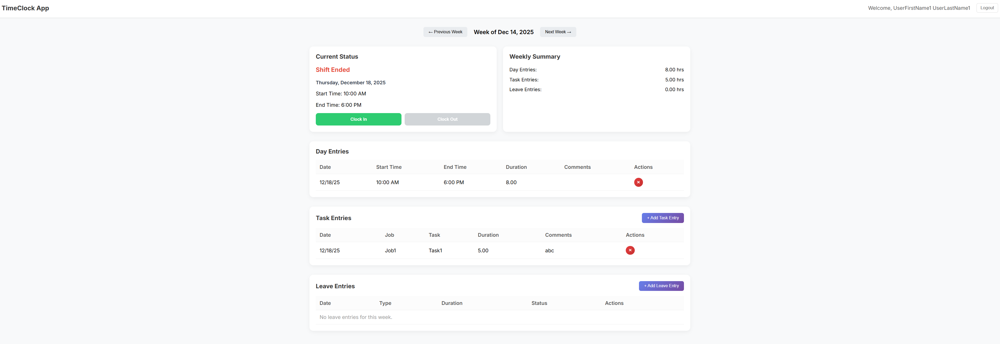
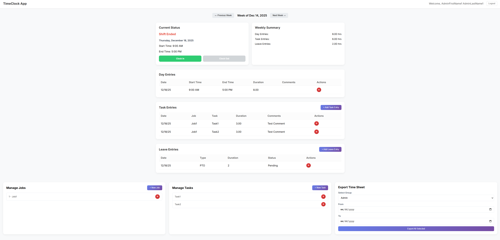

# Timeclock Web Application

## Overview
Timeclock is a comprehensive web application designed for tracking employee time, managing jobs, and handling leave requests. It provides a seamless experience for both employees and administrators to manage daily operations efficiently.

## Features
- **Time Tracking**: Employees can easily clock in and out, tracking their daily duties and hours.
- **Job Management**: Complete job tracking system allowing users to associate time entries with specific jobs.
- **Leave Management**: Submit leave requests directly through the portal.
- **Role-Based Access**:
    - **User Dashboard**: Personalized view for employees to manage their time and tasks.
    - **Admin Dashboard**: Centralized control for administrators to oversee users, jobs, and system settings.

## Technology Stack
- **Backend**: ASP.NET Core 6 Web API
- **Frontend**: Angular 19 SPA
- **Database**: Entity Framework Core with SQL Server
- **Authentication**: ASP.NET Core Identity

## Project Structure
```
Time_Clock_App/
├── Backend/              # ASP.NET Core Web API
├── Backend.Tests/        # xUnit backend tests
├── Frontend/             # Angular SPA
├── e2e/                  # Playwright E2E tests
├── docs/                 # Documentation and screenshots
└── README.md
```

## Testing

### Test Summary
| Layer | Framework | Tests | Coverage |
|-------|-----------|-------|----------|
| Backend | xUnit + Moq | 189 | 83% line, 52% branch |
| Frontend | Jasmine/Karma | 159 | 97% statement |
| E2E | Playwright | 22 | - |

### Running Tests

**Backend Tests**
```bash
cd Backend.Tests
dotnet test
```

**Backend Tests with Coverage**
```bash
cd Backend.Tests
dotnet test --collect:"XPlat Code Coverage" --results-directory ./coverage
~/.dotnet/tools/reportgenerator "-reports:./coverage/*/coverage.cobertura.xml" "-targetdir:./coverage/report" -reporttypes:Html
```

**Frontend Tests**
```bash
cd Frontend
npm test
```

**Frontend Tests with Coverage**
```bash
cd Frontend
npm run test:coverage
```

**E2E Tests**
```bash
cd e2e
npx playwright test
```

## Dashboards

### User Dashboard
The user dashboard provides quick access to daily tasks, current job status, and time entry history.


### Admin Dashboard
The admin dashboard offers powerful tools for managing the workforce, approving requests, and generating reports.
